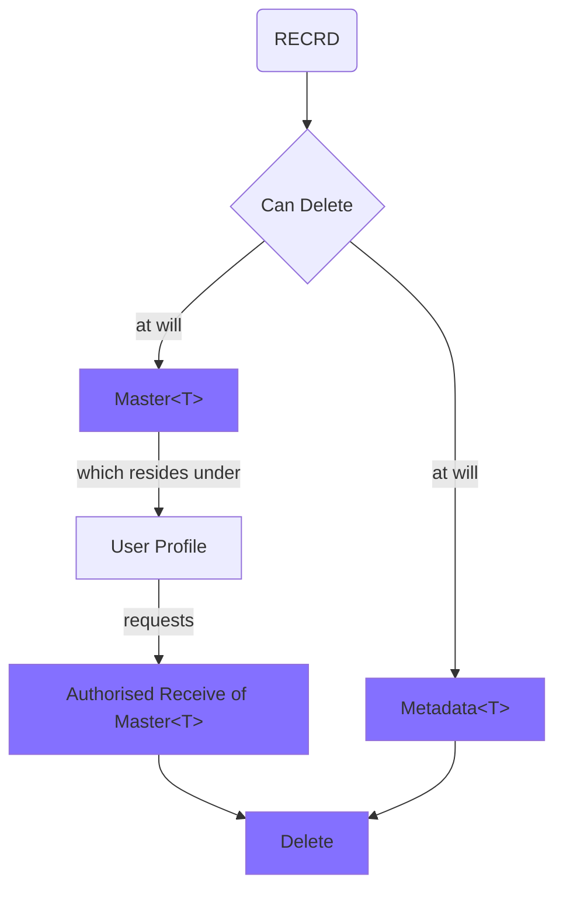

## RECRD delete flows

```mermaid
flowchart TD
  A(RECRD) --> B{Can Delete}
	B --> |at will| C[Master#60;T#62;]:::onChainAction
	B --> |at will| D[Metadata#60;T#62;]:::onChainAction
	C --> |which resides under|E[User Profile]
	E --> |requests|F[Authorised Receive of Master#60;T#62;]:::onChainAction
	F --> G[Delete]:::onChainAction
	D --> G
	

classDef onChainAction fill:#8470FF
classDef suiInfra fill:#C4A484
```