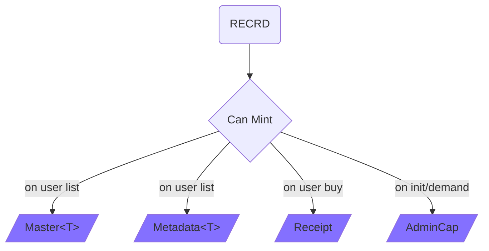

## RECRD mint flows

```mermaid
flowchart TD
  A(RECRD) --> C{Can Mint}
	C --> |on user list| CA[/Master#60;T#62;/]:::onChainAction
	C --> |on user list| CB[/Metadata#60;T#62;/]:::onChainAction
	C --> |on user buy| CC[/Receipt/]:::onChainAction
	C --> |on init/demand| CD[/AdminCap/]:::onChainAction

classDef onChainAction fill:#8470FF
classDef suiInfra fill:#C4A484
```