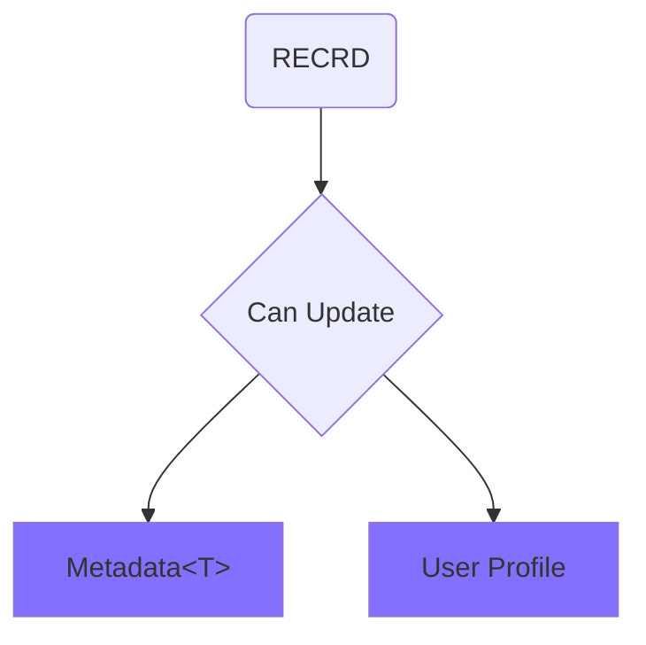

## RECRD update flows

```mermaid
graph TD
  A(RECRD) --> B{Can Update}
	B --> D[Metadata#60;T#62;]:::onChainAction
	B --> E[User Profile]:::onChainAction

classDef onChainAction fill:#8470FF
classDef suiInfra fill:#C4A484
```