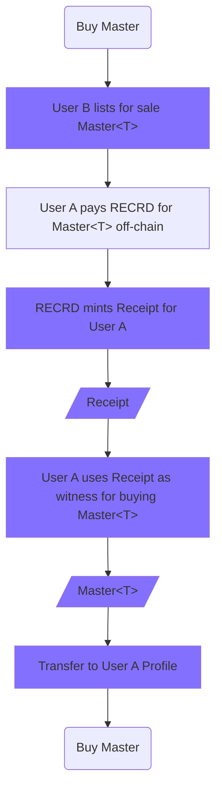

## Buy Master

```mermaid
flowchart TD
	A(Buy Master) --> B[User B lists for sale Master#60;T#62;]:::onChainAction
  B --> BA[User A pays RECRD for Master#60;T#62; off-chain]
	BA --> C[RECRD mints Receipt for User A]:::onChainAction
	C --> D[/Receipt/]:::onChainAction
	D --> E[User A uses Receipt as witness for buying Master#60;T#62;]:::onChainAction
	E --> F[/Master#60;T#62;/]:::onChainAction
	F --> G[Transfer to User A Profile]:::onChainAction
	G --> H(Buy Master)

classDef onChainAction fill:#8470FF
classDef suiInfra fill:#C4A484
```