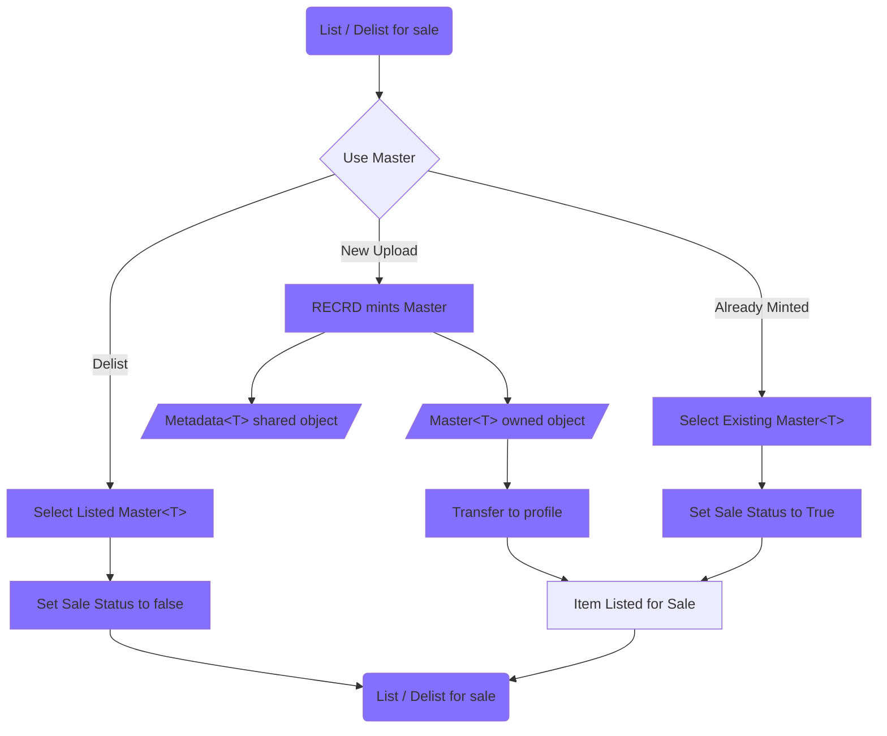

## List/delist for sale

```mermaid
flowchart TD
  A(List / Delist for sale):::onChainAction --> AB{Use Master}
	AB --> |New Upload| B[RECRD mints Master]:::onChainAction
	AB --> |Already Minted| C[Select Existing Master#60;T#62;]:::onChainAction
	AB --> |Delist| CC[Select Listed Master#60;T#62;]:::onChainAction
	CC --> BB[Set Sale Status to false]:::onChainAction
	BB --> J
	B --> E[/Metadata#60;T#62; shared object/]:::onChainAction
	B --> F[/Master#60;T#62; owned object/]:::onChainAction
	F --> G[Transfer to profile]:::onChainAction
	G --> H[Item Listed for Sale]
	C --> I[Set Sale Status to True]:::onChainAction
	I --> H
	H --> J(List / Delist for sale):::onChainAction

classDef onChainAction fill:#8470FF
classDef suiInfra fill:#C4A484
```