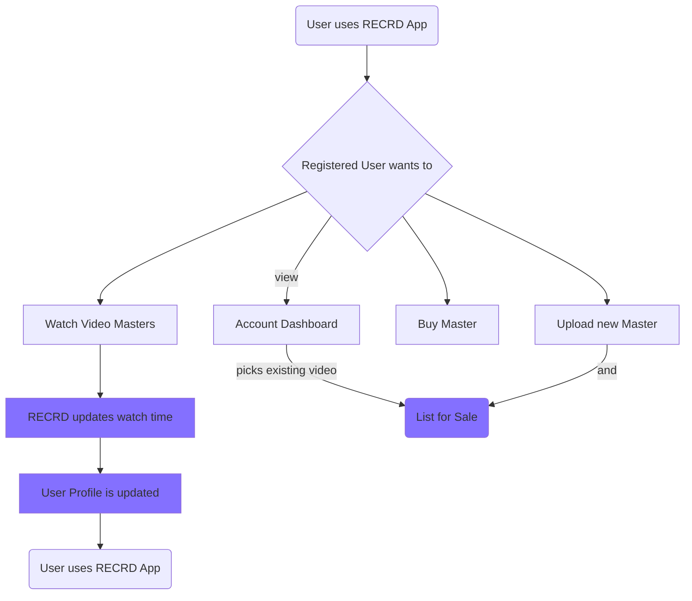

## Registered user uses app after onboarding

```mermaid
flowchart TD
  A(User uses RECRD App) --> B{Registered User wants to}
	B --> C[Watch Video Masters]
	C --> CA[RECRD updates watch time]:::onChainAction
	CA --> CB[User Profile is updated]:::onChainAction
	B --> D[Upload new Master]
	B --> BA[Buy Master]
	B -->|view| E[Account Dashboard]
	E --> |picks existing video| F(List for Sale):::onChainAction
	D --> |and| F
	CB --> P(User uses RECRD App)

classDef onChainAction fill:#8470FF
classDef suiInfra fill:#C4A484
```