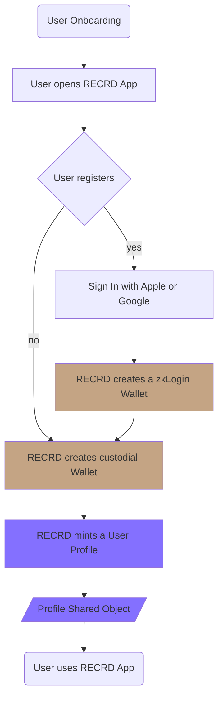

## Wallets Creation on first landing

```mermaid
flowchart TD
A(User Onboarding) --> B[User opens RECRD App]
B --> C{User registers}
C --> |yes| D[Sign In with Apple or Google]
C --> |no| E[RECRD creates custodial Wallet]:::suiInfra
D --> F[RECRD creates a zkLogin Wallet]:::suiInfra
F --> E
E --> G[RECRD mints a User Profile]:::onChainAction
G --> H[/Profile Shared Object/]:::onChainAction
H --> I(User uses RECRD App)

classDef onChainAction fill:#8470FF
classDef suiInfra fill:#C4A484
```